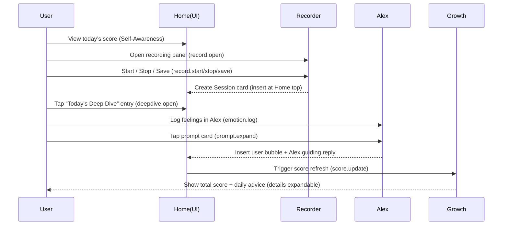
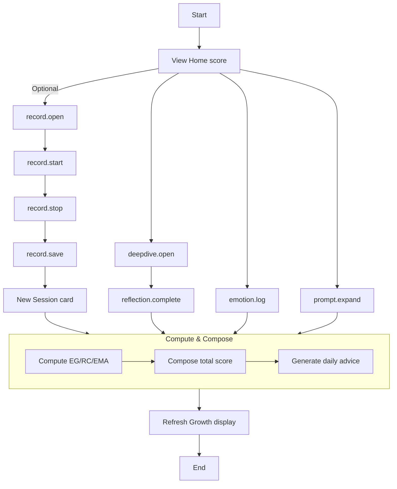

# MindRing MVP 1.0 · PRD 0.2 (Self‑Awareness Single Metric)

Version: 0.2 (based on UI0.2 changes)
Scope: Home, Alex Companion, Today’s Deep Dive, Growth Tracking; right‑side standalone recording panel; single metric “Self‑Awareness Compass”.

---

## 1. Goals & Positioning
- Target users: knowledge workers, creators, independent learners (English‑first).
- Core value: 3 minutes a day to get an explainable self‑awareness score + guided reflection.
- MVP scope: focus solely on the “Self‑Awareness” single metric; reduce information density and shorten the behavior loop.

## 2. Key Product Metrics
- D1/D7 retention
- Daily emotion logging rate (≥1/day)
- Daily reflection completion rate (≥1/day)
- Score stability (days with EMA‑smoothed score ≥70)

---

## 3. Core Data Flow

### 3.1 Capture & Triggers
- Recording (Home → right‑side recording panel):
  - Open panel: `record.open`
  - Start recording: `record.start`
  - Stop recording: `record.stop`
  - Save to session feed: `record.save` (append a `Session` card at the top of `home-sessions`)
- Emotion logging (Alex → Log Feelings):
  - Tap emotion chips: `emotion.log`
  - Supports composite emotions (e.g., “Curious + Wary”)
- Suggested prompts (Alex → Suggested Prompts):
  - Tap prompt card: `prompt.expand` (expands inline within Alex conversation, no page redirect)
- Deep dive (Home → Today’s Deep Dive entry card):
  - Tap entry card: `deepdive.open` (open the daily reflection page)

### 3.2 Processing & Calculation
- Light text normalization:
  - Emotion dictionary mapping; identify specificity/composite emotions (dictionary + simple rules).
- Metrics (rolling 24h window):
  - Emotion Granularity (EG, 0–1)
  - Reflection Completion (RC, 0–1)
  - Consistency (EMA, 0–1)
- Total score (0–100):
  - `Score = round(100 * (0.4*EG + 0.4*RC + 0.2*EMA))`
- Advice (rule‑driven):
  - Generate 2–3 daily advice chips based on low components (e.g., low EG → add naming; low RC → complete reflection; low EMA → maintain frequency)

### 3.3 Storage & Display
- Update `ScoreSnapshot` (with score and components)
- Growth page displays the key number (UI0.2: 48px) and hides component details behind a “View Score Breakdown” button
- Home session feed gets a new card upon save
- Alex conversation inserts user bubble + Alex guide reply when prompt expands

---

## 4. Data Models

### 4.1 Core Entities
- User
  - `id`: string
  - `locale`: string (e.g., `en-US`)
  - `createdAt`: ISO datetime

- Session (home session card)
  - `id`: string
  - `timestamp`: ISO datetime
  - `source`: enum (`ring`, `manual`, `alex`, `recording`)
  - `title`: string
  - `summary`: string
  - `emotions`: EmotionEntry[]
  - `tags`: string[]

- EmotionEntry
  - `id`: string
  - `timestamp`: ISO datetime
  - `labels`: string[] (supports composite labels, e.g., `["Curious","Wary"]`)
  - `granularityScore`: number (0–1) (rule‑based specificity/compositeness score)

- ReflectionRecord
  - `id`: string
  - `date`: YYYY-MM-DD
  - `status`: enum (`completed`, `skipped`, `pending`)
  - `notes`: string

- ScoreSnapshot (24h)
  - `timestamp`: ISO datetime
  - `selfAwareness`: number (0–100)
  - `components`: {
    - `emotionGranularity`: number (0–1)
    - `reflectionCompletion`: number (0–1)
    - `consistencyEMA`: number (0–1)
  }

- Advice
  - `id`: string
  - `date`: YYYY-MM-DD
  - `chips`: string[] (e.g., "Name two emotions", "Complete today’s reflection", "Review premise/concern")

### 4.2 Auxiliary Entities
- AlexPrompt
  - `id`: string
  - `text`: string
  - `category`: enum (`outreach`, `planning`, `clarify`, `reflect`)
  - `estimatedTime`: string (e.g., `~2 min chat`)

---

## 5. Scoring Model

### 5.1 Components
- Emotion Granularity (EG, 40%)
  - Goal: more specific/composite emotion naming → higher score.
  - Calculation:
    - 24h emotion entries `N`; specific/composite entries `K`.
    - `EG_base = clamp(K / max(1, min(3,N)), 0, 1)`
    - Specificity boost via dictionary (`specificityBoost ∈ [0,0.2]`)
    - `EG = clamp(EG_base + specificityBoost, 0, 1)`

- Reflection Completion (RC, 40%)
  - Goal: complete one guided reflection today.
  - Calculation: `RC = 1` if completed, else `RC = 0`; can extend to staged completion (e.g., premise/concern named → 1.0).

- Consistency (EMA, 20%)
  - Goal: stabilize behavior, reduce noisy jumps.
  - Calculation:
    - `EMA_t = α * S_t + (1-α) * EMA_(t-1)`, recommended `α = 0.3`
    - `S_t` can be `min(EG, RC)` or `0.5*EG + 0.5*RC`
    - Init: `EMA_0 = S_0`

### 5.2 Total Score
- `Score = round(100 * (0.4*EG + 0.4*RC + 0.2*EMA))`
- Rationale: emphasize naming/specificity and completing reflection; EMA as a smoothing term, not a hard penalty.

### 5.3 Display & Advice
- Growth shows the key number (48px); details collapsed behind "View Score Breakdown"
- Daily advice chips based on low components:
  - Low EG: recommend naming two emotions, use more specific words
  - Low RC: recommend completing today’s reflection (entry on Home)
  - Low EMA: recommend maintaining logs for 3 consecutive days

---

## 6. Business Flow

### 6.1 Daily Loop (3 minutes)
1) View “Self‑Awareness 72” on Home
2) (Optional) open right‑side recording panel → quick capture → save to generate a session card
3) Tap “Today’s Deep Dive” entry → complete today’s reflection (RC=1)
4) View updated score and advice on Growth (details expandable)

### 6.2 Alex Conversation Flow
- System hints today’s emotion signal (e.g., “Energized + Wary”)
- Tap “Suggested Prompts” to expand inline in the conversation (`prompt.expand`)
- Tap “Log Feelings” to create `EmotionEntry`
- Insert user bubble + Alex guiding reply (no page redirect)

### 6.3 Recording Flow
- Tap Mic → right‑side panel opens
- Start/Stop/Save → create a `Session` card and insert to Home top
- Panel is standalone and does not overlay main content (UI0.2 layout: `span4` + `span2`)

### 6.4 Growth Refresh
- Triggered by events (`emotion.log`, `reflection.complete`, `record.save`) or schedule
- Compute components → compose total score → update UI → refresh advice chips

---

## 7. Events & Instrumentation (Prototype)
- `record.open` / `record.start` / `record.stop` / `record.save`
- `emotion.log` (with `labels[]`)
- `prompt.expand`
- `deepdive.open` / `reflection.complete`
- `score.update`

---

## 8. UI & Interaction Changes (UI0.2)
- Home: add “Today’s Deep Dive” entry card (gradient accent at top)
- Recording: change from overlay modal to standalone right‑side panel (sticky)
- Alex: prompt cards expand within the conversation (keep context)
- Growth: key number enlarged to 48px; components hidden behind a button

---

## 9. Boundaries & Non‑Goals
- No cross‑user comparison; score is a personal mirror and trend
- No medical/therapeutic advice; MVP prototype does not process private audio in cloud
- No complex model training; use light rules/dictionary + EMA smoothing

---

## 10. Validation & Next Steps
- Validation:
  - D1/D7 retention, daily emotion logging & reflection completion, score stability
  - Interviews: comprehension of score, explainability, utility of advice
- Next steps:
  - Interactive explanation page for component breakdown
  - Expand emotion dictionary and specificity assessment
  - Tighter choreography between Alex prompts and Deep Dive questions

---

## 11. Score Breakdown – Copy & Examples

### 11.1 Expanded Copy (UI)
- Emotion Granularity (EG): specificity/compositeness of emotion naming in 24h. More specific/composite → higher score.
- Today’s Reflection (RC): whether you completed guided reflection (premise/concern naming).
- Consistency (EMA): stability across recent days; smooths volatility.

Copy examples:
- “You completed reflection and logged two specific emotions today. Keep consistent logging for more stable scores.”
- “Try more specific words (e.g., ‘nervous’ → ‘concern about delivery window’).”

### 11.2 Example Values & Calculation
- Example components: `EG=0.62`, `RC=0.92`, `EMA=0.54`
- Total: `Score = round(100 * (0.4*0.62 + 0.4*0.92 + 0.2*0.54)) ≈ 72`
- Display: Growth shows “72”; details via “View Score Breakdown”.

### 11.3 Edge Cases
- If `RC=0` (no reflection today), total drops significantly; guide user to complete reflection.
- If no emotion logs in 24h, `EG≈0`; offer guided words and examples.
- EMA is smoothing, not punishment; keep it explainable.

### 11.4 Score Range Copy Templates
- 0–49 (Starting):
  - Copy: Start by naming 1–2 specific emotions, record the triggering premise/concern.
  - Suggestion: Use “Log Feelings”, choose more specific words (e.g., “nervous” → “concern about delivery window”).
- 50–69 (Improving):
  - Copy: You’re logging consistently; completing today’s reflection will lift the score.
  - Suggestion: Tap “Today’s Deep Dive” and name premise/concern (RC=1).
- 70–84 (Good):
  - Copy: Maintain stable rhythm; be more specific about triggers in reflection.
  - Suggestion: Log composite emotions (e.g., “Curious + Wary”) to increase EG.
- 85–100 (Stable High):
  - Copy: Stable over two weeks; weekly review of themes/patterns recommended.
  - Suggestion: Build a personal glossary of common triggers and specific words.

---

## 12. Core Sequence & Event Flow (Mermaid)

### 12.1 Daily Loop (Sequence Diagram)


### 12.2 Event Flow (Flowchart)


### 12.3 Exception Handling (Flowchart)
```mermaid
flowchart TD
  Start[Start] --> CheckEmotion[Any emotion logs in 24h?]
  CheckEmotion -->|Yes| EGCalc[Compute EG]
  CheckEmotion -->|No| EGZero[EG=0; guide to log feelings]

  EGCalc --> CheckRC[Reflection completed today?]
  EGZero --> CheckRC

  CheckRC -->|Yes| RCOne[RC=1]
  CheckRC -->|No| RCZero[RC=0; guide to complete reflection]

  subgraph EMA
    PrepareS[Compute S_t (e.g., 0.5*EG + 0.5*RC)] --> HasPrevEMA[Has EMA_(t-1)?]
    HasPrevEMA -->|Yes| EMANext[EMA_t = α*S_t + (1-α)*EMA_(t-1)]
    HasPrevEMA -->|No| EMAInit[EMA_0 = S_t]
  end

  RCOne --> PrepareS
  RCZero --> PrepareS

  EMANext --> ComposeScore[Compose total score]
  EMAInit --> ComposeScore

  ComposeScore --> AdviceGen[Generate daily advice]
  AdviceGen --> UIRefresh[Refresh Growth]
  UIRefresh --> End[End]
```