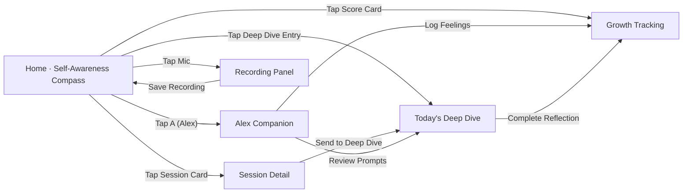

# MindRing MVP 1.0 · Self-Awareness Companion

## Overview

- Vision: A calm shelter for independent thinkers. 3 minutes a day to get an explainable Self-Awareness score + guided reflection.
- Target Users: English-first creators and knowledge workers (NA/EU) who value low-friction capture and high-quality reflection.
- Core Value: Single metric focus on "Self-Awareness Compass" - combining emotion granularity, reflection completion, and consistency tracking.
- Sources: `doc/MVP1.0_PRD0.2.md` (Product Requirements) and `doc/MVP1.0_UI0.2_En.html` (Interactive UI Prototype).

## MVP Scope (P0)

- Ring v1.0: single-click recording, haptic feedback, BLE pairing, stable OTA.
- App v1.0 Modules:
  - Home: Self-Awareness Compass (single metric 0-100), Today's Deep Dive entry, recent sessions stream.
  - Recording Panel: right-side standalone panel for quick audio capture, save to session feed.
  - Session Detail: expandable view with key insights, AI tags, audio playback, and next-step actions.
  - Alex Companion: emotion logging, suggested prompts (expand inline), guided reflection triggers.
  - Today's Deep Dive: short (~6 min) guided reflection to complete daily Self-Awareness score.
  - Growth Tracking: 24h Self-Awareness score with expandable breakdown (Emotion Granularity + Reflection Completion + Consistency).

## UI Flow (MVP1.0_UI0.2_En)



### Interaction Notes
- Back Button: present on non-Home views in the top `appbar` (‹). Returns to previous view or Home if stack is empty.
- Home: 
  - Tap "Self-Awareness Compass" score → Growth Tracking.
  - Tap any session card → Session Detail modal.
  - Tap `A` (Alex avatar) → Alex Companion.
  - Tap Mic → opens right-side Recording Panel (standalone, non-modal).
  - Tap "Today's Deep Dive" entry → guided reflection page.
- Recording Panel: Start/Stop/Save workflow; saving creates new session card at top of Home feed.
- Session Detail: Shows key insights, AI tags, audio playback controls, and "Send to Today's Deep Dive" action.
- Alex Companion:
  - `Review Prompts` shows 3 contextual prompts that expand inline within conversation.
  - `Log Feelings` opens emotion chips; selections update Self-Awareness components.
- Today's Deep Dive: Short guided reflection (~6 min); completion updates the 24h Self-Awareness score.
- Growth Tracking: Displays main Self-Awareness score (0-100) with expandable breakdown of components.

## Assets

- `doc/MVP1.0_UI0.2_En.html`: Interactive UI prototype with Self-Awareness single metric focus and recording panel.
- `doc/MVP1.0_PRD0.2.md`: Product Requirements Document v0.2 with detailed specifications.
- `design/AlexLogo.svg`: Alex avatar.

## Preview

```bash
# Start local server
python3 -m http.server 8000

# Open the UI prototype
open doc/MVP1.0_UI0.2_En.html
```

## License

This project is open source for educational and personal use only. **Commercial use is strictly prohibited.**

- ✅ Personal use and learning
- ✅ Educational purposes
- ✅ Non-commercial research
- ❌ Commercial applications
- ❌ Selling or monetizing the code
- ❌ Using in commercial products or services

For commercial licensing inquiries, please contact the project maintainers.

## Next Steps
- Implement recording panel with Start/Stop/Save workflow and session feed integration.
- Add Session Detail modal with audio playback and "Send to Deep Dive" functionality.
- Complete Self-Awareness scoring algorithm with Emotion Granularity + Reflection Completion + Consistency (EMA).
