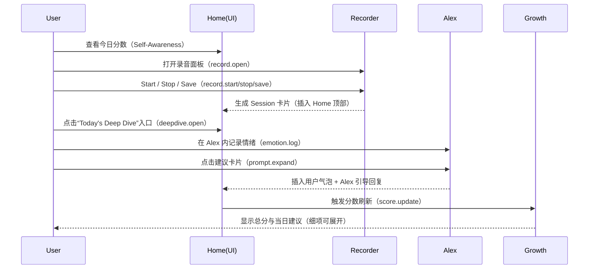
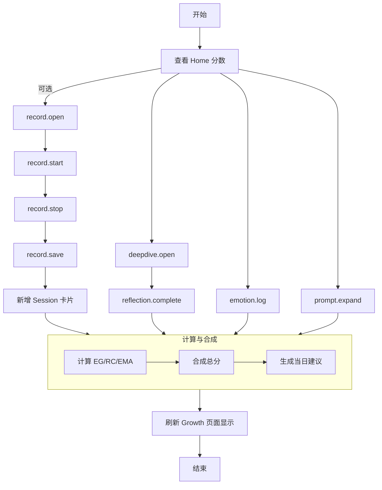
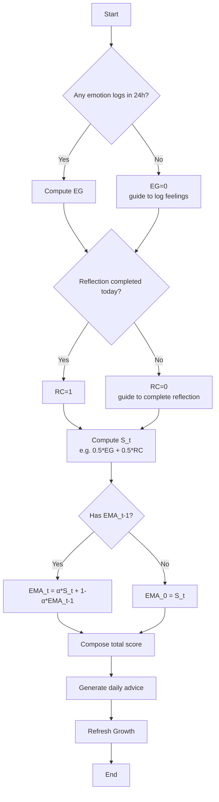

# MindRing MVP 1.0 · PRD 0.2（Self‑Awareness 单指标）

版本：0.2（基于 UI0.2 变更）
范围：Home、Alex Companion、Today’s Deep Dive、Growth Tracking；右侧独立录音面板；单指标“Self‑Awareness Compass”。

---

## 1. 目标与定位
- 目标用户：知识工作者、创作者、独立学习者（英语市场为先）。
- 核心价值：每日 3 分钟，获得可解释的自我觉察分数 + 引导式反思。
- MVP 范围：仅聚焦“Self‑Awareness”单指标；简化信息层次、缩短行为闭环。

## 2. 关键指标（产品侧）
- D1/D7 留存率
- 每日情绪记录率（≥1 次/天）
- 每日反思完成率（≥1 次/天）
- 分数稳定性（EMA 平滑后 ≥70 的连续天数）

---

## 3. 核心数据流程（Data Flow）

### 3.1 采集与触发
- 录音采集（Home → 右侧独立录音面板）：
  - 打开录音面板：`record.open`
  - 开始录音：`record.start`
  - 停止录音：`record.stop`
  - 保存到会话流：`record.save`（生成一条 `Session` 卡片，追加到 `home-sessions` 顶部）
- 情绪记录（Alex → Log Feelings）：
  - 点击情绪 Chip：`emotion.log`
  - 支持复合情绪（如“Curious + Wary”）
- 建议执行（Alex → Suggested Prompts）：
  - 点击建议卡片：`prompt.expand`（在 Alex 对话内展开，不跳转页面）
- 深度反思（Home → Today’s Deep Dive 入口卡片）：
  - 点击入口卡片：`deepdive.open`（进入当天反思页面）

### 3.2 处理与计算
- 文本归类（轻量）：
  - 情绪词归一化，复合/具体情绪识别（字典/词典 + 简单规则）。
- 指标计算（24h 滚动窗口）：
  - Emotion Granularity（情绪粒度，0–1）
  - Reflection Completion（当天反思完成度，0–1）
  - Consistency（EMA 一致性，0–1）
- 总分合成（0–100）：
  - `Score = round(100 * (0.4*EG + 0.4*RC + 0.2*EMA))`
- 建议生成（规则驱动）：
  - 根据低维度项生成 2–3 条当天建议（例如：EG 低 → 增加情绪命名；RC 低 → 完成今日反思；EMA 低 → 保持记录频率）

### 3.3 存储与展示
- 更新 `ScoreSnapshot`（包含分数与子项）
- Growth 页面刷新“72”关键数字（UI0.2：隐藏细节，用“View Score Breakdown”按钮承载）
- Home 会话流新增卡片（录音保存后）
- Alex 对话中插入用户消息 + Alex 引导回复（点击建议卡片后）

---

## 4. 数据模型（Models）

### 4.1 核心实体
- User
  - `id`: string
  - `locale`: string (e.g., `en-US`)
  - `createdAt`: ISO datetime

- Session（首页会话卡片）
  - `id`: string
  - `timestamp`: ISO datetime
  - `source`: enum (`ring`, `manual`, `alex`, `recording`)
  - `title`: string
  - `summary`: string
  - `emotions`: EmotionEntry[]
  - `tags`: string[]  （如 `Self‑Awareness`, `New`）
  - `audioURL`: URL? （录音文件路径，可选；用于播放真实录音内容）

- EmotionEntry（情绪记录）
  - `id`: string
  - `timestamp`: ISO datetime
  - `labels`: string[] （支持复合，如 `["Curious","Wary"]`）
  - `granularityScore`: number (0–1)  （基于具体度与复合度的规则评分）

- ReflectionRecord（当天反思）
  - `id`: string
  - `date`: YYYY-MM-DD
  - `status`: enum (`completed`, `skipped`, `pending`)
  - `notes`: string

- ScoreSnapshot（分数快照，24h）
  - `timestamp`: ISO datetime
  - `selfAwareness`: number (0–100)
  - `components`: {
    - `emotionGranularity`: number (0–1)
    - `reflectionCompletion`: number (0–1)
    - `consistencyEMA`: number (0–1)
  }

- Advice（当天建议）
  - `id`: string
  - `date`: YYYY-MM-DD
  - `chips`: string[]  （如：“命名两种情绪”、“完成今日反思”、“复盘引发情绪的前提”）

### 4.2 辅助实体
- AlexPrompt（建议项）
  - `id`: string
  - `text`: string
  - `category`: enum (`outreach`, `planning`, `clarify`, `reflect`)
  - `estimatedTime`: string（如 `~2 min chat`）

---

## 5. 打分模型（Models of Scoring）

### 5.1 组件定义
- Emotion Granularity（EG，40%）
  - 目标：更具体、复合的情绪命名 → 更高分。
  - 计算：
    - 近 24h 情绪记录数 `N`；其中“具体或复合”记录数 `K`。
    - `EG_base = clamp(K / max(1, min(3,N)), 0, 1)`
    - 词典具体度加权（例如：`specificityBoost ∈ [0,0.2]`）
    - `EG = clamp(EG_base + specificityBoost, 0, 1)`

- Reflection Completion（RC，40%）
  - 目标：当天完成至少一次引导式反思。
  - 计算：`RC = 1`（完成），否则 `RC = 0`；可扩展为分级（如“完成核心问题 + 命名前提/关切”计 1.0）。

- Consistency（EMA，20%）
  - 目标：保持稳定记录，避免噪声波动。
  - 计算：使用指数移动平均：
    - `EMA_t = α * S_t + (1-α) * EMA_(t-1)`，建议 `α = 0.3`
    - `S_t` 可取当日 `min(EG, RC)` 或 `0.5*EG + 0.5*RC`
    - 初始化：`EMA_0 = S_0`

### 5.2 总分
- `Score = round(100 * (0.4*EG + 0.4*RC + 0.2*EMA))`
- 解释：强化“命名/具体度”和“完成反思”的权重；一致性作为平滑项而非惩罚项。

### 5.3 展示与建议
- Growth 页面显示总分（UI0.2：48px 关键数字）
- 细项默认折叠（按钮展开：“View Score Breakdown”）
- 当日建议（Advice）基于低分项生成：
  - EG 低：建议命名两种情绪、使用更具体词汇
  - RC 低：建议完成今日反思（入口在 Home 近期卡片顶部）
  - EMA 低：建议保持连续 3 天记录

---

## 6. 业务流（Business Flow）

### 6.1 日常闭环（3 分钟）
1) Home 页面查看“Self‑Awareness 72”
2) （可选）点击右侧录音面板 → 快速记录 → 保存生成会话卡片
3) 点击 Home 顶部“Today’s Deep Dive”入口 → 完成当日反思（RC=1）
4) Growth 页面查看更新后的分数与建议（细项可展开）

### 6.2 Alex 对话流
- 系统提示今日情绪线索（如“Energized + Wary”）
- “Suggested Prompts”点按后在对话内展开（`prompt.expand`）
- “Log Feelings”点按情绪 Chip，生成 `EmotionEntry`
- 对话中可插入用户气泡 + Alex 引导回应（不发生页面跳转）

### 6.3 录音采集流
- 点击底部 Mic 按钮 → 右侧面板打开
- Start/Stop/Save → 生成一条 `Session` 卡片并插入 Home 顶部
- 面板独立展示，不遮挡主内容（UI0.2 布局：`span4` + `span2`）

### 6.4 Growth 刷新流
- 定时或事件触发（如 `emotion.log`, `reflection.complete`, `record.save`）
- 计算组件 → 合成总分 → 更新 UI → 建议 chips 刷新

### 6.5 会话详情查看流
- 点击 Home 页面任意 `Session` 卡片 → 触发 `session.detail.open`
- 弹出 `SessionDetailView` 模态页面，展示：
  - 会话源信息（source、timestamp）
  - 关键要点（Key Insights）
  - AI 生成标签（tags）
  - 音频播放控制（基于 `audioURL`，支持真实录音播放）
  - 下一步操作建议（Next Steps）
- 用户可通过关闭按钮或手势返回 Home 页面

---

## 7. 事件与埋点（前端原型）
- `record.open` / `record.start` / `record.stop` / `record.save`
- `emotion.log`（包含 `labels[]`）
- `prompt.expand`
- `deepdive.open` / `reflection.complete`
- `session.detail.open` / `session.audio.play` / `session.audio.stop`
- `score.update`

---

## 8. UI 与交互变更摘要（UI0.2）
- Home：新增"Today's Deep Dive"入口卡片（顶部，渐变样式）
- 录音：从叠加模态改为右侧独立面板（sticky）
- Alex：建议卡片点击在对话内展开（保持上下文）
- Growth：关键数字加大为 48px；隐藏细项，用"View Score Breakdown"按钮承载
- Session 卡片：支持点击跳转到详情页面，播放按钮优先播放真实录音（基于 `audioURL`）
- SessionDetailView：新增会话详情模态页面，展示完整会话信息和音频播放控制

---

## 9. 边界与非目标
- 不进行跨用户比较；分数仅用于个人镜像与趋势
- 不做医疗/治疗建议；不涉及隐私语音云端处理（MVP 本地原型）
- 不实现复杂模型训练；使用轻量规则/词典与 EMA 平滑

---

## 10. 验证与下一步
- 验证：
  - D1/D7 留存、每日情绪记录与反思完成率、分数稳定性
  - 访谈：用户理解度、分数解释性与建议的实用性
- 下一步：
  - 细项分数的展开交互与说明页
  - 情绪词典扩充与具体度评估优化
  - 将 Alex 建议与 Deep Dive 问题更紧密编排

---

## 11. Score Breakdown 解释与示例

### 11.1 展开文案（UI）
- 情绪粒度（EG）：24h 内你的情绪命名的具体度与复合度。更具体/复合，分数更高。
- 今日反思（RC）：你是否完成了当日引导式反思（含命名前提/关切）。
- 一致性（EMA）：近几日的稳定记录程度，用于平滑分数波动。

提示文案示例：
- “你今天完成了反思，并记录了两种具体情绪。继续保持连续记录，分数会更稳定。”
- “建议尝试更具体的情绪词（例如‘紧张’→‘对交付时间的担忧’）。”

### 11.2 示例数据与计算
- 示例组件：`EG=0.62`, `RC=0.92`, `EMA=0.54`
- 总分计算：`Score = round(100 * (0.4*0.62 + 0.4*0.92 + 0.2*0.54)) = round(100 * (0.248 + 0.368 + 0.108)) = round(100 * 0.724) ≈ 72`
- 展示：Growth 页面显示“72”，细项通过“View Score Breakdown”展开。

### 11.3 边界与特殊情况
- 若 `RC=0`（当日未完成反思），总分会显著下降；建议引导用户完成当日反思。
- 若 24h 内无情绪记录，则 `EG≈0`；建议提供引导词与示例。
- EMA 仅用于平滑，不作为硬性惩罚；确保数值可解释。

### 11.4 分数段文案模板（UI 提示）
- 0–49（起步）：
  - 文案：今天从“命名 1–2 个具体情绪”开始，并记录触发的前提/关切。
  - 建议：打开“Log Feelings”，选择更具体的词（如“紧张”→“对交付时间的担忧”）。
- 50–69（改善中）：
  - 文案：你最近在持续记录；完成今天的反思可显著提升分数。
  - 建议：点击“Today’s Deep Dive”，命名前提与关切（RC=1）。
- 70–84（良好）：
  - 文案：保持稳定节律；尝试在反思中更具体地描述情绪触发。
  - 建议：记录复合情绪（如“Curious + Wary”），增加 EG。
- 85–100（稳定高水平）：
  - 文案：近两周稳定；建议每周复盘主题与模式，形成个人词表。
  - 建议：将常见触发情境与具体词汇整理为清单，持续迭代。

---

## 12. 核心时序与事件流（Mermaid）

### 12.1 日常闭环（Sequence Diagram）

### 12.2 事件流（Flowchart）

### 12.3 异常数据处理（Flowchart）
